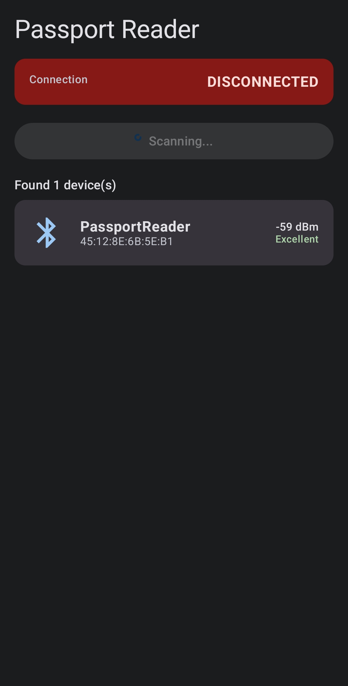
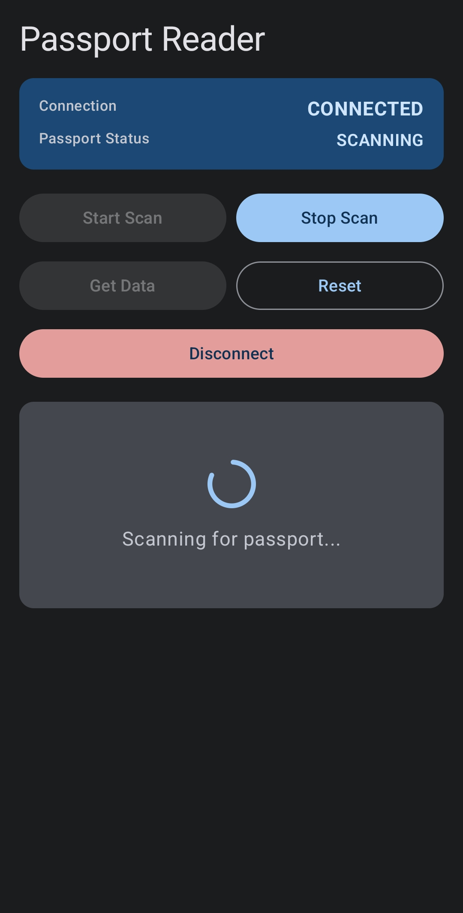
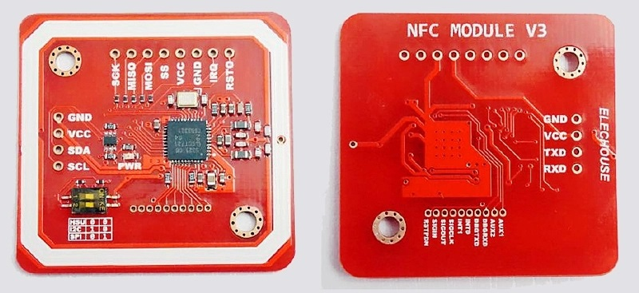
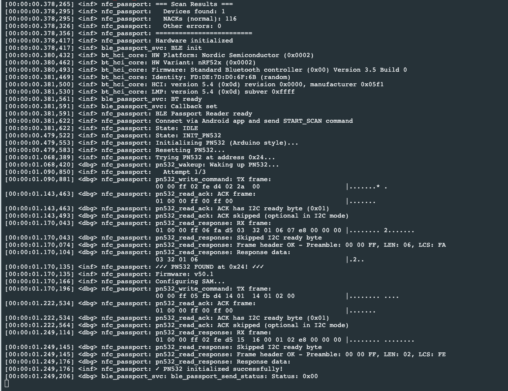

# TechMapPOC
TechMap POC - https://www.nagarro.com/en/careers/nagarro-connect/tech-maps

This is a Proof of Concept (POC) implementation demonstrating the integration of NFC passport reading using a Nordic nRF52 microcontroller and a PN532 NFC reader module. The POC includes firmware for the nRF52, an Android application for user interaction, and the necessary hardware connections.

POC Details:


┌─────────────────────────────────────────────────────────────┐
│                         System Overview                     │
└─────────────────────────────────────────────────────────────┘

    Android App                 nRF52 MCU              PN532 NFC
    ┌──────────┐               ┌──────────┐           ┌──────────┐
    │          │               │          │           │          │
    │  BLE     │◄─────────────►│  BLE     │           │          │
    │  Client  │   Wireless    │  Stack   │           │          │
    │          │               │          │           │   RF     │
    │          │               │  State   │◄─────────►│  Field   │
    │  UI      │               │  Machine │    I2C    │          │
    │  Display │               │          │           │ Antenna  │
    │          │               │  Zephyr  │           │          │
    └──────────┘               │  RTOS    │           └──────────┘
                               └──────────┘                │
                                                           │
                                                      ┌────▼────┐
                                                      │ Passport│
                                                      │  Card   │
                                                      └─────────┘


### Communication Flow
```
Android App                    nRF52 Firmware                  PN532
    │                              │                             │
    ├──[Connect BLE]──────────────►│                             │
    │                              │                             │
    ├──[START_SCAN]───────────────►│                             │
    │                              ├──[InListPassiveTarget]─────►│
    │                              │                             │
    │                              │◄────[Card UID]──────────────┤
    │                              │                             │
    │◄──[Status: CARD_DETECTED]───┤                             │
    │                              │                             │
    │                              ├──[Select ePassport App]────►│
    │                              │◄────[ACK]───────────────────┤
    │                              │                             │
    │                              ├──[Read DG1]────────────────►│
    │                              │◄────[MRZ Data]──────────────┤
    │                              │                             │
    │◄──[Passport Data]────────────┤                             │
    │                              │                             │
```

### Required Components

| Component             | Model/Type                          | Quantity | Notes                         |
| --------------------- | ----------------------------------- | -------- | ----------------------------- |
| **Microcontroller**   | nRF52832/nRF52840 Development Board | 1        | Nordic nRF52-DK or compatible |
| **NFC Reader**        | PN532 Breakout Board                | 1        | I2C mode compatible           |
| **Antenna**           | 13.56MHz NFC Antenna                | 1        | Usually included with PN532   |
| **LEDs**              | Standard LEDs                       | 4        | Status indicators (optional)  |
| **Resistors**         | 330Ω                                | 4        | For LEDs (if used)            |
| **Pull-up Resistors** | 4.7kΩ                               | 2        | For I2C (if not on breakout)  |
| **Wires**             | Jumper wires                        | ~10      | For connections               |
| **Power Supply**      | USB or Battery                      | 1        | 5V USB or 3.7V LiPo           |

### Pin Connections

#### nRF52 to PN532 (I2C Mode)

| nRF52 Pin | PN532 Pin | Function             |
| --------- | --------- | -------------------- |
| P0.26     | SDA       | I2C Data             |
| P0.27     | SCL       | I2C Clock            |
| P0.28     | IRQ       | Interrupt (optional) |
| P0.29     | RST       | Reset                |
| 3.3V      | VCC       | Power                |
| GND       | GND       | Ground               |

### Firmware Development

- **Zephyr RTOS:** v3.5.0 or later
- **Zephyr SDK:** Compatible with Zephyr version
- **CMake:** v3.20 or later
- **Python:** v3.8 or later
- **West:** Zephyr's meta-tool
- **ARM GCC Toolchain:** For compilation

### Android Development

- **Android Studio:** Arctic Fox or later
- **Minimum SDK:** Android 8.0 (API 26)
- **Target SDK:** Android 13 (API 33)
- **Kotlin:** 1.8 or later
- **Gradle:** 7.0 or later




## Hardware Setup

### Step 1: Configure PN532

1. Locate SEL0 and SEL1 switches/jumpers on your PN532 breakout
2. Set for I2C mode:
   - SEL0: OFF (open)
   - SEL1: ON (closed)
3. Connect the NFC antenna to the PN532 module

### Step 2: Wire Connections

**I2C Connections:**
```
nRF52          PN532
─────────      ──────────
P0.26    ────► SDA
P0.27    ────► SCL
P0.28    ────► IRQ
P0.29    ────► RST
3.3V     ────► VCC
GND      ────► GND
```



**LED Connections (Optional):**
```
nRF52          LED + Resistor
─────────      ──────────────
P0.13    ────► LED0 ─[330Ω]─► GND
P0.14    ────► LED1 ─[330Ω]─► GND
P0.15    ────► LED2 ─[330Ω]─► GND
P0.16    ────► LED3 ─[330Ω]─► GND
```

